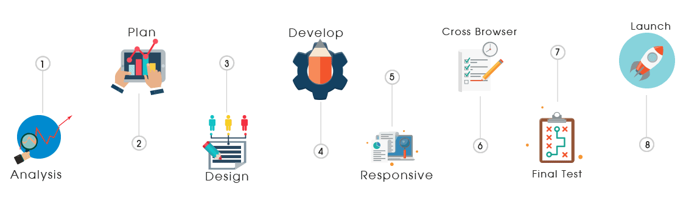

<h1 align="center">Hi , I'm Imran Ali </h1>

[

](https://git.io/typing-svg)

<h4> I'm a Full Stack Web Developer skilled in MERN stack who focuses on writing clean, elegant and efficient code. </h4>
<h4> I'm a passionate learner who's always willing to learn and work across technologies and domains. I love to explore new technologies and leverage them to solve real-life problems. </h4>

<h2> About Me  </h2>

- 🔭 I'm currently working on repository [Work](https://github.com/ftnimran/linknest)

- 🌱 I’m currently learning **DevOps**

- 💬 Ask me about **MERN Stack**

- 👨‍💻 All of my projects are available at [Portfolio](https://portfolio05.qzz.io/)

- 📄 Know about my experiences <a href="./animation/imran-ali.pdf">Resume</a>

- 📫 How to reach me **imran30599@gmail.com**

- 👯 I’m looking to collaborate on the [Project](https://github.com/ftnimran/Team-Work)

## <b> Skills</b>

<!---
##

  | Category           | Technologies                                          |
| ------------------ | ----------------------------------------------------- |
| **Frontend**       | React, Next.js, TypeScript, Tailwind CSS, HTML5, CSS3 |
| **Backend**        | Node.js, Express, Go, PostgreSQL, MongoDB, Prisma     |
| **DevOps**         | Docker, GitHub Actions, Vercel, Nginx                 |
| **Testing & Auth** | Jest, Vitest, Supertest, JWT                          |

--->

##  <b> Connect with me </b>

##  GitHub Stats</h2>

  
 

<!---

  
  

--->

##

  
   

##  <b>Top repository</b>

  
  
  
  

